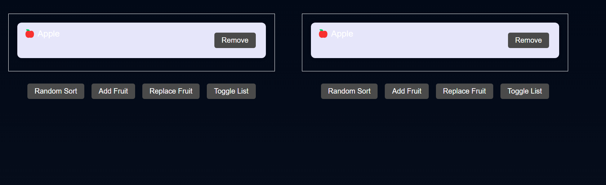
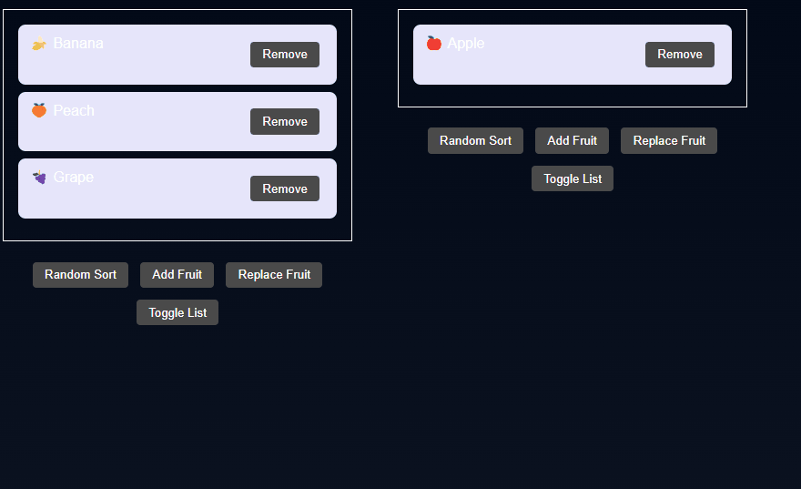
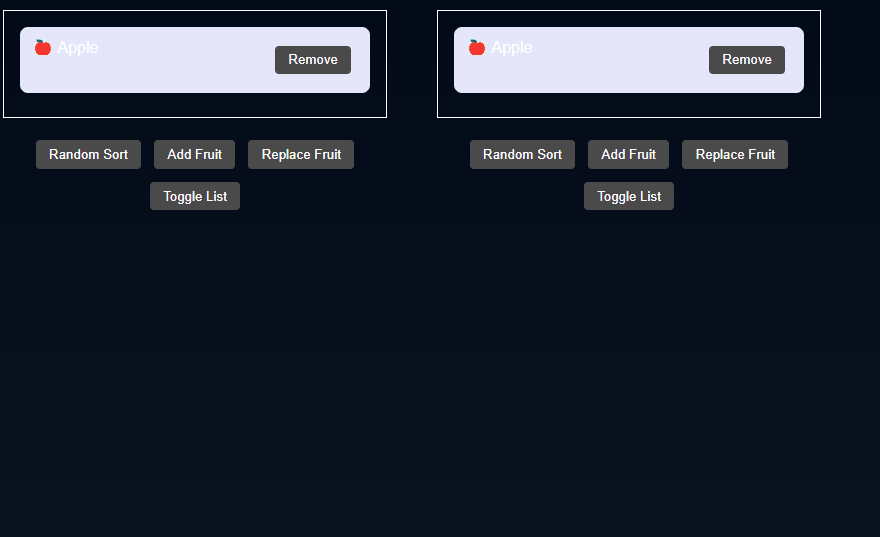

# 仿写一个auto-animate

视频教程: https://www.bilibili.com/list/476962702


[auto-animate](https://auto-animate.formkit.com/)可以自动给所配置元素的直接子元素的新增、删除、移动加上动画，使用非常简便，下面是如何仿写一个简单的此库

## 思路

auto-animate的实现思路是利用 MutationObserver监听元素的变动，获取到位置变动（新增、删除、继续存在）的元素element，然后根据之前保存的每个元素的旧的位置信息，结合当前此元素的位置信息，计算出transform，利用element.animate重放动画，从而产生动画效果；在处理删除操作时需要把被删除的元素重新插入回子元素list中，重放它的消失动画

## 前序知识

[MutationObserver](https://developer.mozilla.org/en-US/docs/Web/API/MutationObserver)： 监听DOM的变动， 可以监听元素的变动， 包括新增、删除已经元素的属性变动，使用方式可以参考下[mutation-observer](https://javascript.info/mutation-observer)

```
<div contentEditable id="elem">Click and <b>edit</b>, please</div>

<script>
let observer = new MutationObserver(mutationRecords => {
  console.log(mutationRecords); // console.log(the changes)
});

observer.observe(elem, {
  childList: true, // 监听直接子元素
  subtree: true, // 监听所有的子元素
});
</script>
```

[ResizeObserver](https://developer.mozilla.org/en-US/docs/Web/API/ResizeObserver)： 监听元素的尺寸变动

[element.animate](https://developer.mozilla.org/en-US/docs/Web/API/Element/animate)： 创建一个动画


## 实现


### 环境搭建

使用rsbuild创建一个react-ts项目，然后安装auto-animate， 用于和自行实现的版本进行效果对比
首先是使用方式相同，入参如下：

```ts
export const autoAnimate = (
  parent: HTMLElement,
  options: {
    duration: number;  // 动画持续时间
    easing:  'linear' | 'ease-in' | 'ease-out' | 'ease-in-out' | string; // 动画缓动函数
  },
) => {
//  to be implemented
}
```
参考auto-animate的doc部分的代码，搭建一个测试页面 

### 实现

#### 主体结构

主体逻辑分三步：

1. 获取到parent的position，如果为static，则设置为relative， 因为动画实现需要用到绝对定位，所以要个parent设置relative
2. 处理parent和其直接子元素，记录当前位置信息，并监听resize
3. mutation监听parent的子元素的变动

```tsx
export const autoAnimate = (
  parent,
  options,
) => {
  if(getComputedStyle(parent).position === "static") {
    parent.style.position = "relative";
  }
    // 处理parent元素和parent的直接子元素
   addCallbacks(parent, [
    // 初始化操作，保存当前位置信息
    (element) => {
      coordinateMap.set(element, getCoordinate(element));
    },
  ]);
  // 监听parent的子元素的变动， 使用MutationObserver
  mutation.observe(parent, {
    childList: true,
  });
}

const addCallbacks = (
  element: Element,
  callbacks: Array<(element: Element) => void>,
) => {
  callbacks.forEach((callback) => {
    callback(element);
  });
  for (let i = 0; i < element.children.length; i++) {
    const child = element.children[i];
    if (child) {
      callbacks.forEach((callback) => {
        callback(child);
      });
    }
  }
};

const getCoordinate = (element: Element) => {
  const coordinates = element.getBoundingClientRect();
  let p = element.parentElement;
  let x = 0;
  let y = 0;
  // 因为元素的坐标是相对于父元素的， 所以需要获取父元素的scrollLeft和scrollTop； getBoundingClientRect获取的是元素相对于视口的坐标
  while (p) {
    if (p.scrollLeft || p.scrollTop) {
      x = p.scrollLeft;
      y = p.scrollTop;
      break;
    }
    p = p.parentElement;
  }
  return {
    top: coordinates.top + y,
    left: coordinates.left + x,
    width: coordinates.width,
    height: coordinates.height,
  };
};

  const resize = new ResizeObserver((entries) => {
    entries.forEach((entry) => {
      updatePos(entry.target);
    });
  });
```

#### mutation具体实现

mutation实现逻辑是需要先获取到变动的元素，然后判断是新增、删除、还是移动，然后根据变动类型， 分别处理新增、删除、移动三种情况

```tsx
  const animate = (element: Element) => {
    const isMounted = element.isConnected;
    const preExist = coordinateMap.get(element);

    if (preExist && isMounted) {
      remain(element);
    } else if (!isMounted && preExist) {
      remove(element);
    } else {
      add(element);
    }
  };

  const getElements = (mutations: MutationRecord[]) => {
    return mutations.reduce((acc: Set<Element> | false, mutation) => {
      // 说明此次mutation是因为为了重放删除元素动画，重新插入了被删除的元素导致的，所以不需要处理
      if (!acc) return false;

      if (mutation.target instanceof Element) {
        if (!acc.has(mutation.target)) {
          acc.add(mutation.target);
          for (let i = 0; i < mutation.target.children.length; i++) {
            const child = mutation.target.children[i];
            if (!child) continue;
            // 说明这次mutation是由于将删除的元素插入回去导致的，所以不需要处理
            if (DELETE in child) {
              return false;
            }
            if (child) {
              acc.add(child);
            }
          }
        }
        if (mutation.removedNodes.length) {
          for (let i = 0; i < mutation.removedNodes.length; i++) {
            const node = mutation.removedNodes[i];
            if (DELETE in node) return false;
            if (node instanceof Element) {
              acc.add(node);
              // 用于展示删除时的动画效果，根据sibling方便把已被删除的元素插入回原来的位置
              siblingsMap.set(node, [
                mutation.previousSibling,
                mutation.nextSibling,
              ]);
            }
          }
        }
      }
      return acc;
    }, new Set<Element>());
  };

  const mutation = new MutationObserver((mutations) => {
    const elements = getElements(mutations);
    if (!elements) return;
    for (const element of elements) {
      animate(element);
    }
  });
```

##### add
新增的逻辑最简单， 只需要获取到新增元素的坐标，然后设置动画即可

```tsx
  const add = (element: Element) => {
    const newCoordinate = getCoordinate(element);
    coordinateMap.set(element, newCoordinate);
    let animation: Animation;
    animation = element.animate(
      [
        { transform: "scale(.98)", opacity: 0 },
        { transform: "scale(0.98)", opacity: 0, offset: 0.5 },
        { transform: "scale(1)", opacity: 1 },
      ],
      {
        duration: options.duration * 1.5,
        easing: "ease-in",
      }
    );
    animateMap.set(element, animation);
    animation.play();
  };
```


##### remove

删除需要从siblingsMap获取到被删除元素的兄弟元素[pre,next]，然后根据pre和next是否存在，判断被删除元素是插入到pre后面还是next前面并将被删除的元素重新插入，然后设置动画，并且监听动画执行，在动画结束后进行cleanup，将重新插入的元素从siblingsMap、coodinateMap中删除

```tsx
  const remove = (element: Element) => {
    if (!siblingsMap.has(element) || !coordinateMap.has(element)) return;
    element[DELETE] = true;
    const [pre, next] = siblingsMap.get(element)!;
    if (next?.parentNode && next.parentNode instanceof Element) {
      next.parentNode.insertBefore(element, next);
    } else if (pre?.parentNode && pre.parentNode instanceof Element) {
      pre.parentNode.appendChild(element);
    } else {
      parent.appendChild(element);
    }
    const oldCoordinate = coordinateMap.get(element)!;
    const { width, height } = oldCoordinate;
    let offsetParent: Element | null = element.parentElement;

    const parentStyles = getComputedStyle(offsetParent);
    const parentCoords =
      coordinateMap.get(offsetParent) || getCoordinate(offsetParent);

    const top =
      Math.round(oldCoordinate.top - parentCoords.top) -
      raw(parentStyles.borderTopWidth);
    const left =
      Math.round(oldCoordinate.left - parentCoords.left) -
      raw(parentStyles.borderLeftWidth);

    const styleReset: Partial<CSSStyleDeclaration> = {
      position: "absolute",
      top: `${top}px`,
      left: `${left}px`,
      width: `${width}px`,
      height: `${height}px`,
      margin: "0",
      pointerEvents: "none",
      transformOrigin: "center",
      zIndex: "100",
    };

    Object.assign((element as HTMLElement).style, styleReset);
    const animation = element.animate(
      [
        {
          transform: "scale(1)",
          opacity: 1,
        },
        {
          transform: "scale(.98)",
          opacity: 0,
        },
      ],
      { duration: options.duration, easing: "ease-out" }
    );
    animateMap.set(element, animation);
    animation.play();
    // 动画结束后删除元素
    animation.addEventListener("finish", () => {
      element.remove();
      coordinateMap.delete(element);
      siblingsMap.delete(element);
    });
  };
```


##### remain

remain的逻辑是获取到元素的旧坐标和新的坐标，然后计算出坐标的移动和宽高的变化并设置动画，动画结束后，将元素的坐标信息从coodinateMap中删除

```tsx
  const remain = (element: Element) => {
    const oldCoordinate = coordinateMap.get(element);
    const newCoordinate = getCoordinate(element);
    let animation: Animation;

    if (!oldCoordinate) return;
    const deltaX = oldCoordinate.left - newCoordinate.left;
    const deltaY = oldCoordinate.top - newCoordinate.top;

    const start = {
      transform: `translate(${deltaX}px, ${deltaY}px)`,
      height: `${oldCoordinate.height}px`,
      width: `${oldCoordinate.width}px`,
    };
    const end = {
      transform: "translate(0, 0)",
      height: `${newCoordinate.height}px`,
      width: `${newCoordinate.width}px`,
    };

    animation = element.animate([start, end], options);
    coordinateMap.set(element, newCoordinate);
    animation.play();
  };
```

### 实现效果

左边是自行实现的版本，右边是auto-animate的版本，可以看到大体的动画功能出来了，但是在动效生成的时候元素有宽高的跳变，需要处理


#### 处理宽高跳变

宽高跳变是因为在remain的时候，设置了元素的宽高同时还设置了easing函数，导致元素的宽高也在动画的计算范围内，所有有跳变，在宽高相同的时候不设置宽高可处理此问题

```tsx
const remain = (element: Element) => {
    // ...
    const start = {
      transform: `translate(${deltaX}px, ${deltaY}px)`,
      height: `${oldCoordinate.height}px`,
      width: `${oldCoordinate.width}px`,
    };
    const end = {
      transform: "translate(0, 0)",
      height: `${newCoordinate.height}px`,
      width: `${newCoordinate.width}px`,
    };

    if (start.height === end.height) {
      delete start.height;
      delete end.height;
    }
    if (start.width === end.width) {
      delete start.width;
      delete end.width;
    }

    animation = element.animate([start, end], options);
    // ...
}
```

处理后效果如下，添加时的跳变没有了，但是在添加时外部的边框会有跳变，删除元素时也有跳变，需要进一步处理：


#### 处理外部边框跳变和删除时元素跳变

出现这种跳变的原因是元素的box-sizing为content-box， 用getBoundingClientRect获取的元素的宽高是包含padding和border的，需要处理这种情况

```tsx
const getTransitionSize = (
  element: Element,
  oldCoordinate: Coodinate,
  newCoordinate: Coodinate
) => {
  let oldWidth = oldCoordinate.width;
  let oldHeight = oldCoordinate.height;
  let newWidth = newCoordinate.width;
  let newHeight = newCoordinate.height;

  const styles = getComputedStyle(element);
  const isContentBox = styles.getPropertyValue("box-sizing") === "content-box";
  if (isContentBox) {
    const deltaY =
      raw(styles.paddingTop) +
      raw(styles.paddingBottom) +
      raw(styles.borderTopWidth) +
      raw(styles.borderBottomWidth);
    const deltaX =
      raw(styles.paddingLeft) +
      raw(styles.paddingRight) +
      raw(styles.borderRightWidth) +
      raw(styles.borderLeftWidth);
    oldWidth = oldWidth - deltaX;
    oldHeight = oldHeight - deltaY;
    newWidth = newWidth - deltaX;
    newHeight = newHeight - deltaY;
  }
  return {
    oldWidth,
    oldHeight,
    newWidth,
    newHeight,
  };
};


const remain = (element: Element) => {
    // ...
    const { oldWidth, oldHeight, newWidth, newHeight } = getTransitionSize(element, oldCoordinate, getCoordinate(element));

    const { oldWidth, oldHeight, newWidth, newHeight } =   getTransitionSize(element, oldCoordinate, newCoordinate);
    const deltaX = oldCoordinate.left - newCoordinate.left;
    const deltaY = oldCoordinate.top - newCoordinate.top;

    const start = {
      transform: `translate(${deltaX}px, ${deltaY}px)`,
      height: `${oldHeight}px`,
      width: `${oldWidth}px`,
    };
    const end = {
      transform: "translate(0, 0)",
      height: `${newHeight}px`,
      width: `${newWidth}px`,
    };
  // ...

const remove = (element: Element) => {
  // ...
  const oldCoordinate = coordinateMap.get(element)!;
  const { oldWidth:width, oldHeight:height } = getTransitionSize(element, oldCoordinate, getCoordinate(element));
    // ...
}
```

最终效果如下，可以发现基本和auto-animate的效果一致：



## 总结

auto-animate的实现思路是利用 MutationObserver监听元素的变动，获取到位置变动（新增、删除、移动）的元素element，然后根据之前保存的每个元素的旧的位置信息，结合当前此元素的位置信息，计算出transform，利用element.animate重放动画，从而产生动画效果；在处理删除操作时需要把被删除的元素重新插入回子元素list中，重放它的消失动画

此版实现的是最简单的版本，有很多细节没有处理，如父元素有scroll的场景等，有兴趣的可以继续完善

